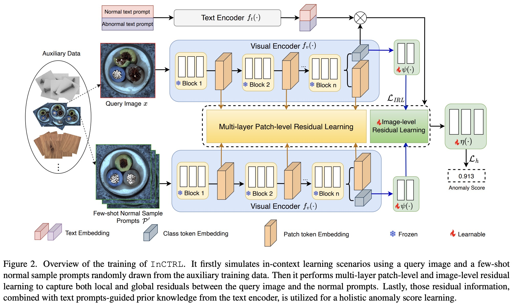

# InCTRL (CVPR 2024)

Official PyTorch implementation of ["Toward Generalist Anomaly Detection via In-context Residual Learning with Few-shot Sample Prompts"](https://arxiv.org/pdf/2403.06495.pdf).

## Overview
In this work, we propose to train a Generalist Anomaly Detection (GAD) model with few-shot normal images as sample prompts for AD on diverse datasets on the fly. To this end, we introduce a novel approach that learns an incontext residual learning model for GAD, termed InCTRL. It is trained on an auxiliary dataset to discriminate anomalies from normal samples based on a holistic evaluation of the residuals between query images and few-shot normal sample prompts. Regardless of the datasets, per definition of anomaly, larger residuals are expected for anomalies than normal samples, thereby enabling InCTRL to generalize across different domains without further training. Comprehensive experiments on nine AD datasets are performed to establish a GAD benchmark that encapsulate the detection of industrial defect anomalies, medical anomalies, and semantic anomalies in both one-vs-all and multi-class setting, on which InCTRL is the best performer and significantly outperforms state-of-the-art competing methods.



## Setup
- python >= 3.10.11
- torch >= 1.13.0
- torchvision >= 0.14.0
- scipy >= 1.10.1
- scikit-image >= 0.21.0
- numpy >= 1.24.3
- tqdm >= 4.64.0

## Device
Single NVIDIA GeForce RTX 3090

## Run
#### Step 1. Download the Anomaly Detection Dataset([ELPV](https://github.com/zae-bayern/elpv-dataset), [SDD](https://www.vicos.si/resources/kolektorsdd/), [AITEX](https://www.aitex.es/afid/), [VisA](https://github.com/amazon-science/spot-diff), [MVTec AD](https://www.mvtec.com/company/research/datasets/mvtec-ad), [BrainMRI](https://www.kaggle.com/datasets/navoneel/brain-mri-images-for-brain-tumor-detection), [HeadCT](https://www.kaggle.com/datasets/felipekitamura/head-ct-hemorrhage), [MNIST](https://www.kaggle.com/datasets/jidhumohan/mnist-png), [CIFAR-10](https://www.kaggle.com/datasets/swaroopkml/cifar10-pngs-in-folders)) and Convert it to MVTec AD Format([the convert script](https://github.com/mala-lab/InCTRL/tree/main/datasets/preprocess)).

The dataset folder structure should look like:
```
DATA_PATH/
    subset_1/
        train/
            good/
        test/
            good/
            defect_class_1/
            defect_class_2/
            defect_class_3/
            ...
    ...
```

#### Step 2. Generate Training/Test Json Files of Anomaly Detection Datasets([the generate script](https://github.com/mala-lab/InCTRL/tree/main/datasets/preprocess)).

The json folder structure should look like:
```
JSON_PATH/
    dataset_1/
        subset_1/
            subset_1_train_normal.json
            subset_1_train_outlier.json
            subset_1_val_normal.json
            subset_1_val_outlier.json
        subset_2/
        subset_3/
        ...
    ...
```

#### Step 3. Download the Few-shot Normal Samples for Inference on [Google Drive](https://drive.google.com/drive/folders/1_RvmTqiCc4ZGa-Oq-uF7SOVotE1RW5QZ?usp=drive_link)

#### Step 4. Download the Pre-train Models on [Google Drive](https://drive.google.com/drive/folders/1McmfxF8_H0BeRvcJ_poGIB-ATQCDDEIa?usp=sharing)

#### Step 5. Quick Start

Change the `TEST.CHECKPOINT_FILE_PATH` in [config](https://github.com/mala-lab/InCTRL/blob/main/open_clip/config/defaults.py) to the path of pre-train model and run
```bash
python test.py --val_normal_json_path $normal-json-files-for-testing --val_outlier_json_path $abnormal-json-files-for-testing --category $dataset-class-name --few_shot_dir $path-to-few-shot-samples
```

For example, if run on the category `candle` of `visa` with `k=2`:
```bash
python test.py --val_normal_json_path /AD_json/visa/candle_val_normal.json --val_outlier_json_path /AD_json/visa/candle_val_outlier.json --category candle --few_shot_dir /fs_samples/visa/2/
```

## Training
```bash
python main.py --normal_json_path $normal-json-files-for-training --outlier_json_path $abnormal-json-files-for-training --val_normal_json_path $normal-json-files-for-testing --val_outlier_json_path $abnormal-json-files-for-testing
```

## Implementation of WinCLIP

WinCLIP is one main competing method to ours, but its official implentation is not publicly available. We have successfully reproduced the results of WinCLIP based on our extensive communications with its authors and used our implementation to perform experiments in the paper. Our implementation has been released at [WinCLIP](https://github.com/mala-lab/WinCLIP).


## Citation

```bibtex
@inproceedings{zhu2024toward,
  title={Toward Generalist Anomaly Detection via In-context Residual Learning with Few-shot Sample Prompts},
  author={Zhu, Jiawen and Pang, Guansong},
  booktitle={Proceedings of the IEEE/CVF conference on computer vision and pattern recognition},
  year={2024}
}
```
